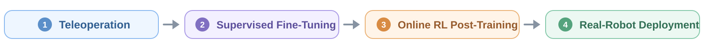

<h1 align="center">VLA-Precision: Asymmetric Co-Bootstrapping for Efficient Real-World Online RL of Vision-Language-Action Models</h1>

<p align="center">
  <a href="https://vla-precision.github.io/"></a>
  <a href="https://github.com/scy-v/vla-precision"></a>
  <a href="LICENSE"></a>
</p>

<p align="center">
  
</p>

<p align="center">
  
</p>

## 🎮 1. Teleoperation and Data Collection

The following projects can be used to collect demonstrations in LeRobot format:

| Robot | Teleoperation | Project | Branch |
|---|---|---|---|
| UR5e/UR7e | Keyboard | [scy-v/lerobot_ur5e_keyteleop](https://github.com/scy-v/lerobot_ur5e_keyteleop/tree/main) | `main` |
| UR5e/UR7e | Isomorphic master–slave | [scy-v/lerobot_ur5e_isoteleop](https://github.com/scy-v/lerobot_ur5e_isoteleop/tree/main) | `main` |
| Dual UR5e/UR7e | VR | [scy-v/lerobot_ur_dual_vrteleop](https://github.com/scy-v/lerobot_ur_dual_vrteleop/tree/main) | `main` |
| Franka | 3D mouse/VR | [Shenzhaolong1330/lerobot_franka_teleop](https://github.com/Shenzhaolong1330/lerobot_franka_teleop/tree/main) | `main` |
| Franka | Keyboard | [Shenzhaolong1330/lerobot_franka_teleop](https://github.com/Shenzhaolong1330/lerobot_franka_teleop/tree/vla-precision) | `vla-precision` |

## 📋 2. Environment Setup

### 2.1 Install [uv](https://docs.astral.sh/uv/getting-started/installation/) and Clone the Repository

```bash
curl -LsSf https://astral.sh/uv/install.sh | sh
git clone https://github.com/scy-v/vla-precision.git  # Deploy on both server and local robot
cd vla-precision
```

### 2.2 Optional: Configure Storage Directories on the Server

```bash
ln -s /path/to/storage/checkpoints ./checkpoints
ln -s /path/to/storage/train_data ./train_data
```

### 2.3 Install Runtime Dependencies

- Policy training runs on the GPU server, with real-robot control provided by the local robot during Stage II.

| Location | Purpose | Command |
|---|---|---|
| GPU server | Stage I | `uv sync --frozen --group stage1` |
| GPU server | Stage II | `uv sync --frozen --group stage2` |
| Local real-robot | Stage II | `uv sync --frozen --group real-robot` |

## 🚀 3. Training Pipeline

Configuration layout:

```text
configs/stage1/               # Stage I
configs/stage2/tasks/         # Stage II tasks and algorithm
configs/stage2/deployments/   # Network, GPUs, and hardware
```

You can find descriptions of all configuration parameters in [CONFIGURATION.md](docs/CONFIGURATION.md).

### 3.1 Stage I: OpenPI full-parameter fine-tuning

Compute normalization statistics:

```bash
# GPU server
uv run --no-sync main.py \
  --stage stage1 \
  --mode norm-stats \
  --config configs/stage1/insert_two_bottles_diagonal_rack.yaml
```

Start OpenPI full-parameter fine-tuning:

```bash
# GPU server
uv run --no-sync main.py \
  --stage stage1 \
  --mode train \
  --config configs/stage1/insert_two_bottles_diagonal_rack.yaml
```

### 3.2 Stage II: ACoB online post-training

Preprocess part of the offline data to populate the Replay Buffer and Context Buffer:

```bash
# GPU server
uv run --no-sync main.py \
  --stage stage2 \
  --mode preprocess \
  --config configs/stage2/tasks/insert_two_bottles_diagonal_rack.yaml \
  --deployment configs/stage2/deployments/single_ur.yaml
```

After preprocessing, start the four processes below to begin online RL training:

```text
Robot machine: robot control service
Robot machine: robot-agent communication bridge
GPU server: Learner
GPU server: Actor
```

Robot machine:

```bash
# Terminal 1: low-level robot control
uv run --no-sync main.py --stage stage2 --mode serve-robot \
  --config configs/stage2/tasks/insert_two_bottles_diagonal_rack.yaml \
  --deployment configs/stage2/deployments/single_ur.yaml

# Terminal 2: connect the local robot system to the remote policy process
uv run --no-sync main.py --stage stage2 --mode robot-agent-bridge \
  --config configs/stage2/tasks/insert_two_bottles_diagonal_rack.yaml \
  --deployment configs/stage2/deployments/single_ur.yaml
```

GPU server:

```bash
# Terminal 1: Learner
uv run --no-sync main.py --stage stage2 --mode train --role learner \
  --config configs/stage2/tasks/insert_two_bottles_diagonal_rack.yaml \
  --deployment configs/stage2/deployments/single_ur.yaml

# Terminal 2: Actor
uv run --no-sync main.py --stage stage2 --mode train --role actor \
  --config configs/stage2/tasks/insert_two_bottles_diagonal_rack.yaml \
  --deployment configs/stage2/deployments/single_ur.yaml
```

All four processes use the same task and deployment YAMLs.

## 📊 4. Evaluation

The evaluation model can run on either the GPU server or the robot machine. When it runs locally, install the corresponding model dependencies:

| Local evaluation model | Installation |
|---|---|
| Stage I full model | `uv sync --frozen --group stage1 --group real-robot` |
| Stage II ACoB model | `uv sync --frozen --group stage2 --group real-robot` |

### 4.1 VLA-Precision evaluation

```bash
# Robot machine · Terminal 1
uv run --no-sync main.py --stage stage2 --mode serve-robot \
  --config configs/stage2/tasks/insert_two_bottles_diagonal_rack.yaml \
  --deployment configs/stage2/deployments/single_ur.yaml

# Robot machine · Terminal 2: connect the robot system to the evaluation policy
uv run --no-sync main.py --stage stage2 --mode robot-agent-bridge \
  --config configs/stage2/tasks/insert_two_bottles_diagonal_rack.yaml \
  --deployment configs/stage2/deployments/single_ur.yaml
```

Run evaluation on either the GPU server or robot machine.

```bash
# Stage I full model
uv run --no-sync main.py --stage stage1 --mode evaluate \
  --config configs/stage2/tasks/insert_two_bottles_diagonal_rack.yaml \
  --deployment configs/stage2/deployments/single_ur.yaml

# Stage II ACoB model
uv run --no-sync main.py --stage stage2 --mode evaluate \
  --config configs/stage2/tasks/insert_two_bottles_diagonal_rack.yaml \
  --deployment configs/stage2/deployments/single_ur.yaml
```

### 4.2 Native OpenPI evaluation

This path evaluates Stage I full models. Its configuration is:

```text
src/vla_precision/integrations/openpi/inference/configs/ur.yaml
```

For a model on the robot machine, set `policy.location: local`:

```bash
# Robot machine
uv run --no-sync main.py --stage stage1 --mode openpi-inference \
  --config src/vla_precision/integrations/openpi/inference/configs/ur.yaml
```

For a model on the GPU server, set `policy.location: server` and `policy.host`:

```bash
# GPU server
uv run --no-sync main.py --stage stage1 --mode serve-openpi-policy \
  --config src/vla_precision/integrations/openpi/inference/configs/ur.yaml

# Robot machine
uv run --no-sync main.py --stage stage1 --mode openpi-inference \
  --config src/vla_precision/integrations/openpi/inference/configs/ur.yaml
```

### 4.3 Results

`evaluation.checkpoint_step: 0` selects the latest checkpoint. Results are updated after every episode:

```text
results/<experiment>/vla/<time>.json
results/<experiment>/openpi-native/<time>.json
results/<experiment>/acob/<time>.json
```

## 🧩 5. Extensions and Customization

VLA-Precision can be adapted to new robots, cameras, grippers, teleoperation devices, and tasks by following the [extension guide](docs/EXTENDING.md).

## 📝 6. Citation

```bibtex
@article{vla_precision,
  title   = {VLA-Precision: Asymmetric Co-Bootstrapping for Efficient Real-World Online RL of Vision-Language-Action Models},
  author  = {},
  journal = {},
  year    = {},
  url     = {}
}
```
