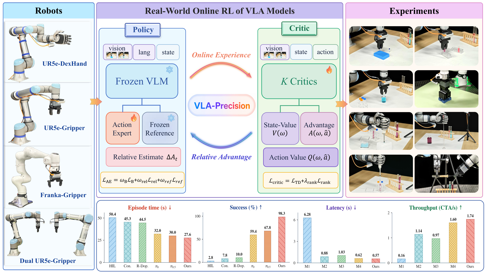

<h1 align="center">VLA-Precision: Asymmetric Co-Bootstrapping for Efficient Real-World Online RL of Vision-Language-Action Models</h1>

<p align="center">
  <a href="https://vla-precision.github.io/"></a>
  <a href="https://github.com/scy-v/vla-precision"></a>
  <a href="LICENSE"></a>
</p>

<p align="center">
  
</p>

<p align="center">
  
</p>

## 🎮 1. 遥操作与数据采集

可使用以下项目采集 LeRobot 格式的示范数据：

| 机器人 | 遥操作方式 | 项目 | 分支 |
|---|---|---|---|
| UR5e/UR7e | 键盘 | [scy-v/lerobot_ur5e_keyteleop](https://github.com/scy-v/lerobot_ur5e_keyteleop/tree/main) | `main` |
| UR5e/UR7e | 同构主从 | [scy-v/lerobot_ur5e_isoteleop](https://github.com/scy-v/lerobot_ur5e_isoteleop/tree/main) | `main` |
| 双臂 UR5e/UR7e | VR | [scy-v/lerobot_ur_dual_vrteleop](https://github.com/scy-v/lerobot_ur_dual_vrteleop/tree/main) | `main` |
| Franka | 3D鼠标/VR | [Shenzhaolong1330/lerobot_franka_teleop](https://github.com/Shenzhaolong1330/lerobot_franka_teleop/tree/main) | `main` |
| Franka | 键盘 | [Shenzhaolong1330/lerobot_franka_teleop](https://github.com/Shenzhaolong1330/lerobot_franka_teleop/tree/vla-precision) | `vla-precision` |

## 📋 2. 环境设置

### 2.1 安装 [uv](https://docs.astral.sh/uv/getting-started/installation/) 并克隆仓库

```bash
curl -LsSf https://astral.sh/uv/install.sh | sh
git clone https://github.com/scy-v/vla-precision.git  # 服务器和机器人本地端均需部署
cd vla-precision
```

### 2.2 可选：配置服务器上的存储目录

```bash
ln -s /path/to/storage/checkpoints ./checkpoints
ln -s /path/to/storage/train_data ./train_data
```

### 2.3 安装运行依赖

- 策略训练运行在GPU服务器，Stage II的真机控制运行在机器人本地端。

| 位置 | 用途 | 命令 |
|---|---|---|
| GPU服务器 | Stage I | `uv sync --frozen --group stage1` |
| GPU服务器 | Stage II | `uv sync --frozen --group stage2` |
| 本地真机 | Stage II | `uv sync --frozen --group real-robot` |

## 🚀 3. 训练流程

配置文件：

```text
configs/stage1/               # Stage I
configs/stage2/tasks/         # Stage II任务与算法
configs/stage2/deployments/   # 网络、GPU和硬件
```

你可以在 [CONFIGURATION_zh-CN.md](docs/CONFIGURATION_zh-CN.md) 中查看所有配置参数及其说明。

### 3.1 Stage I：OpenPI全参数微调

计算 normalization statistics：

```bash
# GPU服务器
uv run --no-sync main.py \
  --stage stage1 \
  --mode norm-stats \
  --config configs/stage1/insert_two_bottles_diagonal_rack.yaml
```

启动 OpenPI 全参数微调：

```bash
# GPU服务器
uv run --no-sync main.py \
  --stage stage1 \
  --mode train \
  --config configs/stage1/insert_two_bottles_diagonal_rack.yaml
```

### 3.2 Stage II：ACoB在线后训练

预处理部分离线数据，以填入 Replay Buffer 和 Context Buffer：

```bash
# GPU服务器
uv run --no-sync main.py \
  --stage stage2 \
  --mode preprocess \
  --config configs/stage2/tasks/insert_two_bottles_diagonal_rack.yaml \
  --deployment configs/stage2/deployments/single_ur.yaml
```

预处理完成后，按以下顺序启动四个进程，开始正式的在线RL训练：

```text
机器人本地端：机器人控制服务
机器人本地端：机器人—智能体通信桥
GPU服务器：Learner
GPU服务器：Actor
```

机器人本地端：

```bash
# 终端1：底层机器人控制
uv run --no-sync main.py --stage stage2 --mode serve-robot \
  --config configs/stage2/tasks/insert_two_bottles_diagonal_rack.yaml \
  --deployment configs/stage2/deployments/single_ur.yaml

# 终端2：连接本地机器人系统与远程策略进程
uv run --no-sync main.py --stage stage2 --mode robot-agent-bridge \
  --config configs/stage2/tasks/insert_two_bottles_diagonal_rack.yaml \
  --deployment configs/stage2/deployments/single_ur.yaml
```

GPU服务器：

```bash
# 终端1：Learner
uv run --no-sync main.py --stage stage2 --mode train --role learner \
  --config configs/stage2/tasks/insert_two_bottles_diagonal_rack.yaml \
  --deployment configs/stage2/deployments/single_ur.yaml

# 终端2：Actor
uv run --no-sync main.py --stage stage2 --mode train --role actor \
  --config configs/stage2/tasks/insert_two_bottles_diagonal_rack.yaml \
  --deployment configs/stage2/deployments/single_ur.yaml
```

四个进程使用同一份 task YAML 和 deployment YAML。

## 📊 4. 评估

评估模型可运行在GPU服务器或机器人本地端；在本地运行时，需补充对应阶段的模型依赖：

| 本地评估模型 | 安装命令 |
|---|---|
| Stage I全参数模型 | `uv sync --frozen --group stage1 --group real-robot` |
| Stage II ACoB模型 | `uv sync --frozen --group stage2 --group real-robot` |

### 4.1 VLA-Precision评估

```bash
# 机器人本地端·终端1
uv run --no-sync main.py --stage stage2 --mode serve-robot \
  --config configs/stage2/tasks/insert_two_bottles_diagonal_rack.yaml \
  --deployment configs/stage2/deployments/single_ur.yaml

# 机器人本地端·终端2：连接机器人系统与评估策略
uv run --no-sync main.py --stage stage2 --mode robot-agent-bridge \
  --config configs/stage2/tasks/insert_two_bottles_diagonal_rack.yaml \
  --deployment configs/stage2/deployments/single_ur.yaml
```

评估进程可运行在GPU服务器或机器人本地端。

```bash
# Stage I全参数模型
uv run --no-sync main.py --stage stage1 --mode evaluate \
  --config configs/stage2/tasks/insert_two_bottles_diagonal_rack.yaml \
  --deployment configs/stage2/deployments/single_ur.yaml

# Stage II ACoB模型
uv run --no-sync main.py --stage stage2 --mode evaluate \
  --config configs/stage2/tasks/insert_two_bottles_diagonal_rack.yaml \
  --deployment configs/stage2/deployments/single_ur.yaml
```

### 4.2 OpenPI原生评估

该方式用于Stage I全参数模型，配置文件为：

```text
src/vla_precision/integrations/openpi/inference/configs/ur.yaml
```

模型在机器人本地端时，设置 `policy.location: local`，运行：

```bash
# 机器人本地端
uv run --no-sync main.py --stage stage1 --mode openpi-inference \
  --config src/vla_precision/integrations/openpi/inference/configs/ur.yaml
```

模型在GPU服务器时，设置 `policy.location: server` 和 `policy.host`：

```bash
# GPU服务器
uv run --no-sync main.py --stage stage1 --mode serve-openpi-policy \
  --config src/vla_precision/integrations/openpi/inference/configs/ur.yaml

# 机器人本地端
uv run --no-sync main.py --stage stage1 --mode openpi-inference \
  --config src/vla_precision/integrations/openpi/inference/configs/ur.yaml
```

### 4.3 结果

`evaluation.checkpoint_step: 0` 选择最新checkpoint。每轮结束后立即更新：

```text
results/<experiment>/vla/<time>.json
results/<experiment>/openpi-native/<time>.json
results/<experiment>/acob/<time>.json
```

## 🧩 5. 扩展与定制

参考[扩展指南](docs/EXTENDING_zh-CN.md)，可将VLA-Precision适配到新的机器人、相机、夹爪、遥操作设备和任务。

## 📝 6. 引用

```bibtex
@article{vla_precision,
  title   = {VLA-Precision: Asymmetric Co-Bootstrapping for Efficient Real-World Online RL of Vision-Language-Action Models},
  author  = {},
  journal = {},
  year    = {},
  url     = {}
}
```
